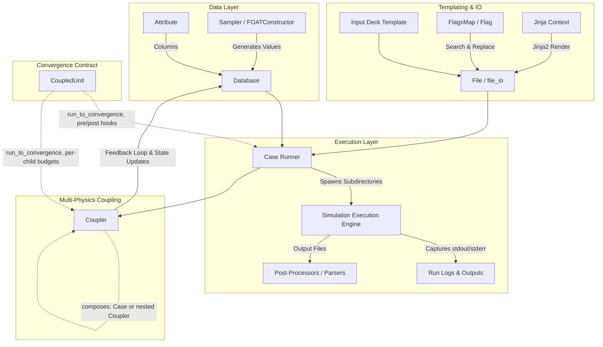

# Architecture & Design Specifications

This document outlines the system architecture, data models, and execution flow of **Labeeb**.

---

## 1. System Architecture Diagram



---

## 2. Core Subsystems

### 2.0 Campaign Manifest Subsystem (`labeeb.campaign`)
* **Validated Configuration**: `CampaignManifest` loads JSON/YAML campaign definitions with parameters, templates, commands, seed, and execution settings.
* **Provenance**: `provenance()` produces deterministic manifest and template SHA-256 hashes plus executable discovery metadata without coupling configuration loading to a specific execution backend.
* **Python Runner**: `Campaign` builds a configured `Case`, executes rows, returns `CaseResult` records, and uses `CampaignStateStore` for hash-aware resume/retry behavior. The CLI delegates to this API.

### 2.1 Results Subsystem (`labeeb.results`)
* **Case Records**: `CaseResult` stores parameters, status, exit code, duration, artifacts, metrics, and failure details for each case.
* **Failure Retention**: `export_case_results()` emits one case-indexed row per supplied result, preserving failures alongside successful results in CSV, JSON, or Parquet output.
* **Campaign State**: `CampaignStateStore` persists attempts and result payloads in SQLite, identifies pending cases, enforces retry budgets, and reuses only successful results with matching input hashes.

### 2.2 Execution Backend Subsystem (`labeeb.execution`)
* **Backend Contract**: `ExecutionBackend.run()` separates command execution from `Case` orchestration.
* **Local Backend**: `LocalExecutionBackend` provides cwd, timeout, logging, and normalized `ExecutionResult` behavior; scheduler and container implementations can be added without changing `Case`.

### 2.3 Design Subsystem (`labeeb.sampler`)
* **Reproducible DOE**: `latin_hypercube_sample()` accepts physical bounds and a seed or generator; `halton_sample()` provides dependency-free low-discrepancy points.

### 2.4 CLI Subsystem (`labeeb.cli`)
* **Configuration Workflow**: `validate`, `run`, `status`, and `resume` expose manifest-driven local campaigns and persisted state without coupling the command parser to future scheduler backends.

### 2.5 Analysis and Reporting Subsystems (`labeeb.analysis`, `labeeb.report`)
* **Sensitivity**: Dependency-light Pearson/Spearman correlations, Morris elementary effects, and Saltelli-form Sobol first/total estimates validate numeric inputs and shapes.
* **Safety Planning**: `wilks_sample_size()` computes one- and two-sided non-parametric tolerance sample sizes, including the standard 95/95 values of 59 and 93.
* **Reports**: `write_html_report()` writes a self-contained case-status summary suitable for attaching to a campaign artifact directory.

### 2.6 Public API Stability
`labeeb.__all__` is the explicit supported import surface for v1.x. Campaign
parameter rows are validated before execution, and incompatible API removals
must wait for a major-version migration.

### 2.1 Database Subsystem (`labeeb.database`)
* **Vectorized Column Operations**: The `Attribute` class provides element-wise numerical operations and logical masking.
* **Storage Agnostic**: `Database` interfaces directly with `pandas.DataFrame` under the hood for serializing to and from CSV, Excel, Parquet, JSON, and Pickle.
* **Integrity Constraints**: All `Attribute` instances in a `Database` must share identical lengths ($N$ rows).

### 2.2 Sampling Subsystem (`labeeb.sampler`)
* **Deterministic Sweeps**: `FOATConstructor` handles full-factorial combinations of multi-dimensional discrete parameters.
* **Stochastic Distributions**: `DiscreteSampling` and parametric sampling distributions generate empirical Monte Carlo sets for uncertainty propagation.

### 2.3 Execution & Templating Subsystem (`labeeb.case`)
* **Dynamic Case Directories**: Automatically creates isolated run folders per parameter set (`run_dir/case_i`).
* **Deck Interpolation**:
  * Delimiter Replacement: Fast token swapping (`#PARAM#` $\rightarrow$ value).
  * Jinja2 Engine: Advanced logic, loops, conditionals, and formatting filters.
* **Subprocess Runner**: Executes simulation commands safely with environment preservation and error detection.

### 2.4 Coupling Subsystem (`labeeb.coupler`)
* **Multi-Code Iterative Solver**: Couples disparate simulation codes (e.g. neutronics codes like MCNP and thermal-hydraulic codes like RELAP5).
* **Feedback Architecture**: Coordinates sequential execution of units, updates cross-mapped parameters, and invokes coupling functions until convergence.
* **Composite Nesting**: `add_case()` accepts either a `Case` or another `Coupler` as a child, uniformly -- enabling sub-coupling (a `Coupler` nested inside a parent `Coupler`).
* **Per-Unit Convergence Budget**: Each child's `max_exec`/`check_fn` are stored on the parent, keyed by child name (`set_unit_convergence()`), settable at `add_case()` time and mutable between coupling steps.

### 2.5 Convergence Contract (`labeeb.coupled_unit`)
* **`CoupledUnit`**: Shared template-method base inherited by both `Case` and `Coupler`.
  * `run_to_convergence(max_exec, check_fn) -> ConvergenceResult`: repeats a single execution pass (`_run_once`) until `check_fn(self, **kwargs)` returns `True` or `max_exec` attempts are used. Never reads `len(database)` -- row/scenario looping stays exclusively in each subclass's own `launch()`.
  * `pre_functions` / `post_functions`: ordered lists of callables run around every pass (`Case.launch_case()` wires these in directly).
  * **Invariant**: when a child unit is itself a `Coupler` (nested/sub-coupling), a parent's `check_fn` only ever sees that child *after* its own `run_to_convergence` has finished (converged or exhausted `max_exec`) -- never mid-iteration.
* **`ConvergenceResult`**: typed dataclass (`unit`, `converged`, `executions`, `residual`) returned by `run_to_convergence()`, with a `to_dict()` for logging/export.

---

## 3. Exception Hierarchy

```
LabeebError (Base)
├── DatabaseError
├── SamplingError
├── CaseExecutionError
└── CouplingError
```
