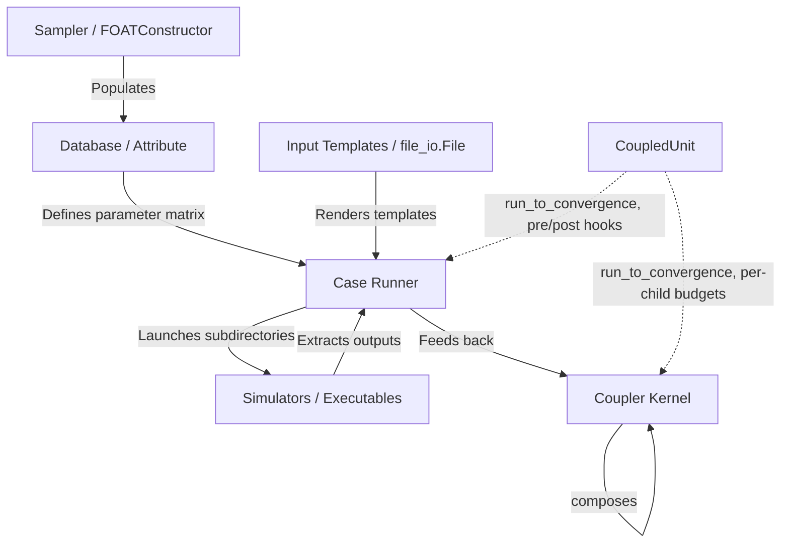

# Labeeb: Sensitivity & Uncertainty Analysis API

[](https://python.org)
[](LICENSE)

**Labeeb** is a professional, general-purpose Python API package developed at the **Jordan Research and Training Reactor (JRTR)**. It provides a clean, programmatic interface for conducting sensitivity analyses, uncertainty studies, and parameter sweeps on any simulation code (e.g. MCNP, RELAP5, or general numerical simulators) that relies on text files as input decks.

---

## 1. Package Architecture

Labeeb is designed for general-purpose model coupling and sensitivity studies. It combines parameter data tables, template search-and-replace linkage flags, and directory orchestrations into a cohesive run loop:



---

## 2. Installation

Install Labeeb locally in editable mode for development:

```bash
pip install -e .[dev]
```

---

## 3. API Usage Guide

### A. Database & Attributes (`labeeb.database`)
`Attribute` represents a sequence column, supporting element-wise math. `Database` operates like a lightweight DataFrame.

```python
from labeeb.database import Attribute, Database

# Create attributes
rho = Attribute(name="RHO", data=[18.5, 19.0, 19.5], unit="g/cm3")
wf = Attribute(name="WF", data=[0.01, 0.02, 0.03], unit="fraction")

# Attributes support element-wise math and comparisons
density_in_g = rho * 1000.0
is_high = rho > 19.0  # Returns Attribute list of booleans

# Orchestrate in a Database
db = Database(name="reactor_params")
db.add_attribute(rho, wf)

# Fetch rows
row_0 = db.get_row(0)  # {'RHO': 18.5, 'WF': 0.01}

# Import and Export tabular CSV/Excel data
db.export_to_file("data.csv")
db.import_from_file("data.csv", option="new")
```

### B. Sampler & Sweeps (`labeeb.sampler`)
Generate design matrices and parameters using grid sweeps or statistical distributions.

```python
from labeeb.sampler import FOATConstructor, DiscreteSampling

# 1. Grid Sweeper (Full Factorial Sweep)
constructor = FOATConstructor()
constructor.add_case({
    "RHO": [18.0, 19.0],
    "WF": [0.01, 0.02, 0.03]
})
grid = constructor.construct()
# Generates 6 combinations of (RHO, WF)

# 2. Discrete Probability Sampling
sampler = DiscreteSampling()
sampler.define_sample(
    values=["A", "B"], 
    probs=[0.85, 0.15]
)
fuel_types = sampler.get_random_sample(n=100)
stats = sampler.stat(m=1000)
```

### B1. Campaign Manifests (`labeeb.campaign`)
Validated JSON and YAML manifests capture a campaign's parameter space, input
templates, commands, seed, and execution settings. Provenance records stable
manifest/template hashes and executable discovery metadata.

```python
from labeeb.campaign import load_manifest

campaign = load_manifest("campaign.yml")
print(campaign.provenance()["manifest_sha256"])
```

### B2. Structured Results (`labeeb.results`)
`CaseResult` retains parameters, execution status, exit code, duration, artifacts,
metrics, and failure details for every case, including failed cases.

```python
from labeeb.results import CaseResult, export_case_results

results = [CaseResult(0, {"RHO": 19.0}, "SUCCESS", 0, 1.2, metrics={"keff": 1.0})]
export_case_results(results, "campaign_results.csv")
```

`CampaignStateStore` persists attempts for resume/retry workflows and prevents
cache reuse when the input hash changes.

```python
from labeeb.results import CampaignStateStore

with CampaignStateStore("campaign_state.sqlite") as state:
    if state.should_reuse(case_id=0, input_hash=input_hash):
        print("reuse cached result")
```

### B3. Execution Backends (`labeeb.execution`)
`Case` uses an injectable execution backend. The built-in local backend runs
shell commands with an explicit case directory, timeout, optional log file,
and normalized `ExecutionResult`; scheduler backends can implement the same
interface later.

```python
from labeeb.case import Case
from labeeb.execution import LocalExecutionBackend

case = Case("local")
case.execution_backend = LocalExecutionBackend()
```

### B4. Configuration-First CLI
The installed `labeeb` command supports manifest validation and local runs:

```bash
labeeb validate campaign.yml
labeeb run campaign.yml --state campaign_state.sqlite
labeeb status campaign_state.sqlite
labeeb resume campaign_state.sqlite
```

### C. Case Launcher & Templates (`labeeb.case` & `labeeb.utils.file_io`)
Define templates, render inputs, execute runs, and parse output tables. Labeeb supports two template rendering options:

#### Option 1: Sequential Placeholder Replacement (`File.replace()`)
For standard template files with unique delimiter-wrapped flags (e.g. `#RHO#`, `#WF#`):

```python
from labeeb.case import Case, Flag, FlagsMap
from labeeb.database import Database
from labeeb.utils.file_io import File

template_file = File(file_path="template.txt")
flags = FlagsMap().add_flag(
    Flag("#RHO#", "RHO", "%5.2f"),
    Flag("#WF#", "WF", "%6.4f")
)

runner = Case(name="simulation_run")
runner.database = Database(data={"RHO": [18.5, 19.0], "WF": [0.01, 0.02]})
runner.FlagsMap = flags
runner.add_file(template_file)
runner.exe_cmd = ["simulator_exec inp=template.txt > log"]
runner.run_case_main_dir = "simulations"

runner.launch()
```

#### Option 2: Jinja2 Template Rendering (`File.render_jinja()`)
For general-purpose dynamic text files utilizing control flows, conditional blocks, or format filters:

```python
from labeeb.utils.file_io import File

# template.txt contains: "VALUE = {{ my_param }}"
template_file = File(file_path="template.txt").read()

# Render template with context
template_file.render_jinja({"my_param": 42.0})
template_file.write("rendered_input.txt")
```

### D. Coupling Kernel (`labeeb.coupler`)
Orchestrate coupled iterations between multiple simulation cases (e.g. thermal-hydraulics and neutronics).

```python
from labeeb.case import Case
from labeeb.coupler import Coupler
from labeeb.database import Database

mcnp_case = Case("mcnp")
relap_case = Case("relap")

# Define coupled sequences
coupler = Coupler(name="coupled_neutronics_th")
coupler.add_cases({
    mcnp_case: ["RHO"],  # Only map RHO to mcnp
    relap_case: ["WF"]   # Only map WF to relap
})

coupler.database = Database(data={
    "RHO": [19.0, 19.2],
    "WF": [0.01, 0.02]
})

# Define iteration callbacks
def callback(self, **kwargs):
    print(f"Iter step {self.c_step}: case {self.case_name} run complete.")

coupler.add_coupling_functions(callback)

# Launch coupled iterations
coupler.launch()
```

### E. Convergence-Driven Execution (`labeeb.coupled_unit`)
`Case` and `Coupler` both inherit `CoupledUnit`, which adds a convergence
loop on top of a single execution pass: `run_to_convergence()` repeats
`launch_case()` (for a `Case`) or a full coupling step (for a `Coupler`)
until a `check_fn` you supply returns `True`, or `max_exec` attempts are
used. Each unit also carries ordered `pre_functions`/`post_functions`
lists, run around every pass -- useful for pulling in the latest state
before a run, or parsing/validating results right after one.

```python
from labeeb.case import Case
from labeeb.database import Database

case = Case(name="mcnp")
case.database = Database(data={"RHO": [19.0]})
# ... FlagsMap / input files / exe_cmd as above ...

def refresh_flags(unit, **kwargs):
    print(f"Starting attempt for {unit.name}")

def check_keff_converged(unit, **kwargs):
    keff = unit.outputs["keff"][-1][-1]
    return abs(keff - 1.0) < 1e-4

case.add_pre_functions(refresh_flags)

result = case.run_to_convergence(max_exec=10, check_fn=check_keff_converged)
print(result.converged, result.executions)  # ConvergenceResult
```

A `Coupler` composes over both `Case` and `Coupler` children uniformly --
a `Coupler` can itself be a child of another `Coupler` for sub-coupling.
Each child's own convergence budget (`max_exec`/`check_fn`) is set at
`add_case()` time and can be changed between coupling steps:

```python
coupler.add_case(mcnp_case, attributes=["RHO"], max_exec=5, check_fn=check_keff_converged)
coupler.set_unit_convergence("mcnp", max_exec=8)  # retune mid-run

# One coupling step: every child runs to ITS OWN convergence (in order),
# then coupling functions fire exactly once -- after all children have
# resolved, not per-child -- so feedback sees every unit's final state.
coupler.launch_case(c_step=0)

# Or drive the whole coupled system to convergence:
result = coupler.run_to_convergence(max_exec=20, check_fn=overall_check_fn)
```

### F. Exception Handling (`labeeb.exceptions`)
Labeeb raises clean, module-specific exceptions to help you identify failures programmatically:
*   `LabeebError`: Base exception class.
*   `DatabaseError`: Issues with Attribute dimensions, operations, or imports.
*   `SamplingError`: Mismatches in sampler sizing or uninitialized CDFs.
*   `CaseExecutionError`: Command-line command errors, missing template decks, or unreadable outputs.
*   `CouplingError`: Missing databases or configurations inside the coupler.

---

## 4. Running Tests

Run the unit test suite to verify code compliance and safety:

```bash
pytest tests/
```
