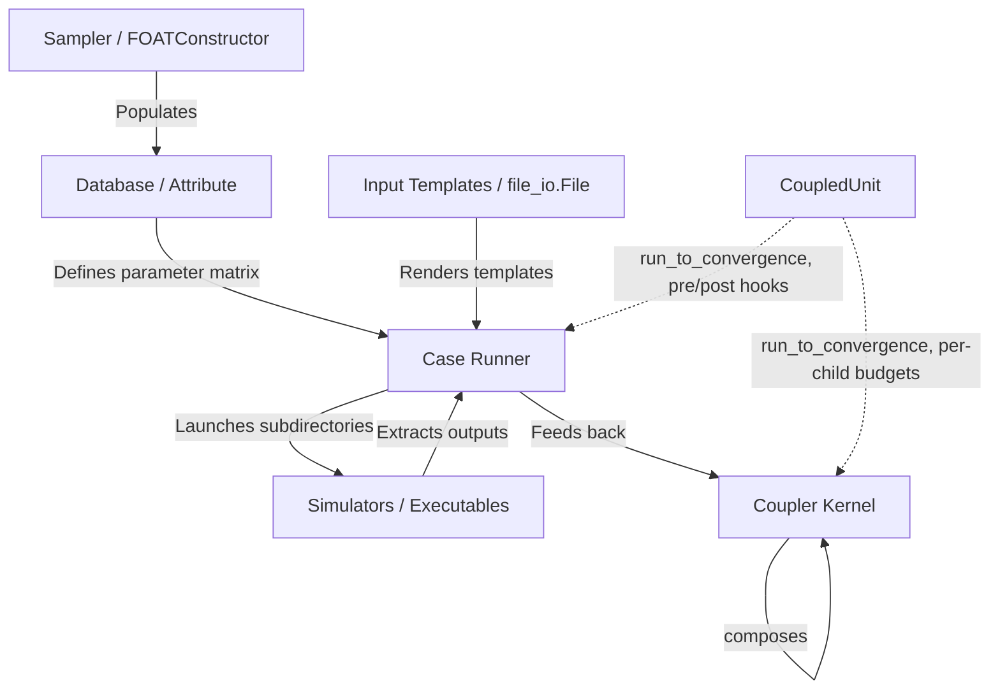

# Labeeb: Sensitivity & Uncertainty Analysis API

[](https://python.org)
[](LICENSE)

**Labeeb** is a professional, general-purpose Python API package for conducting sensitivity analyses, uncertainty studies, and parameter sweeps on any simulation code that relies on text files as input decks.

## What does “Labeeb” mean?

`Labeeb` (لبيب, pronounced approximately *la-beeb*) is an Arabic word meaning
intelligent, discerning, or wise. The name reflects the package’s purpose:
helping a computational study turn many simulation runs into organized,
traceable, and interpretable evidence. Labeeb does not replace the simulator;
it provides the reusable Python layer around the simulator so that inputs,
execution, outputs, analysis, and provenance can be handled consistently.

## Why use Labeeb?

Simulation studies often repeat the same fragile sequence: edit an input file,
create a run directory, launch an external command, parse its output, and copy
the result into a spreadsheet. Labeeb makes that sequence an API-driven
workflow. A typical study is built from these pieces:

| Concept | Responsibility |
| --- | --- |
| `Database` / `Attribute` | Store typed parameters, results, and derived values |
| Samplers and designs | Create factorial, OAT, LHS, Halton, or distribution-based inputs |
| `Case` | Render one input set, execute the external program, and harvest outputs |
| `Campaign` | Run many cases with state, retry, resume, and provenance support |
| `Coupler` | Coordinate iterative workflows between multiple cases |
| Analysis and reports | Quantify sensitivity, uncertainty, convergence, and results |

The primary interface is Python, which makes case studies reproducible and
testable. The command-line interface is a thin convenience layer for validated
manifests and routine campaign operations.

## At a glance

- Works with external programs that consume text or tabular input files.
- Supports deterministic sweeps as well as seeded stochastic sampling.
- Keeps successful and failed case results aligned and queryable.
- Provides flags, assignment replacement, Jinja2, and inline expressions for templates.
- Supports output harvesters, Excel/CSV/JSON/Parquet exchange, and derived attributes.
- Records execution events, command logs, artifacts, retries, and output-catalog entries when enabled.
- Keeps optional AI and optimization integrations separate from the lightweight core.

> 📖 **Comprehensive Guide**: See the complete [v2.3.4 User Manual & API Guide](docs/USER_MANUAL.md) for in-depth examples covering declarative harvesters, coupling stability controls, secure execution, optional integrations, and non-blocking shared campaign memory.

> 🛠️ **Developer Guide**: See [docs/DEVELOPER_GUIDE.md](docs/DEVELOPER_GUIDE.md) for architecture/API contracts, extension points, lifecycle & events, persistence/failure semantics, test conventions, compatibility rules, and debugging recipes.

> 🔄 **v2.0.0 Migration Guide**: See [docs/V2_MIGRATION_GUIDE.md](docs/V2_MIGRATION_GUIDE.md) for v2 API contracts, deprecations, breaking changes, and step-by-step migration examples from v1.x.

---

## 1. Package Architecture

Labeeb is designed for general-purpose model coupling and sensitivity studies. It combines parameter data tables, template search-and-replace linkage flags, and directory orchestrations into a cohesive run loop:



---

## 2. Installation

Labeeb supports standard pip installation from a checkout or package index.

Install the runtime package:

```bash
python -m pip install labeeb
# Optional integrations: pip install "labeeb[excel,parquet]" (spreadsheets/parquet),
# "labeeb[plot]" (live plotting), "labeeb[all]" (everything).
# Core installation needs only pandas/numpy/pyyaml; Excel/Parquet/plotting
# features raise clear install hints when their optional engine is absent.
```

Install from a local checkout in editable mode:

```bash
python -m pip install -e .
```

Install development tools using either the optional dependency group or the
requirements file:

```bash
python -m pip install -e ".[dev]"
# Equivalent requirements-file workflow:
python -m pip install -r requirements-dev.txt
```

The repository also includes a `setup.py` compatibility shim for older tools;
new projects should use the `pyproject.toml`-backed pip commands above.

---

## 3. API Usage Guide

### A. Database & Attributes (`labeeb.database`)
`Attribute` represents a sequence column, supporting element-wise math. `Database` operates like a lightweight DataFrame.

```python
from labeeb.database import Attribute, Database

# Create attributes
rho = Attribute(name="RHO", data=[18.5, 19.0, 19.5], unit="g/cm3")
wf = Attribute(name="WF", data=[0.01, 0.02, 0.03], unit="fraction")

# Attributes support element-wise math and comparisons
density_in_g = rho * 1000.0
is_high = rho > 19.0  # Returns Attribute list of booleans

# Orchestrate in a Database
db = Database(name="reactor_params")
db.add_attribute(rho, wf)

# Declarative Derived Attributes (e.g. power calculation, auto-dependency tracking)
db.add_derived_attribute("RHO_KG", "RHO * 1000.0", unit="kg/m3")
db.add_derived_attribute("SCALED_WF", lambda row: row["WF"] * 100.0, dependencies=["WF"], unit="%")

# Fetch rows
row_0 = db.get_row(0)  # {'RHO': 18.5, 'WF': 0.01, 'RHO_KG': 18500.0, 'SCALED_WF': 1.0}

# Import and Export tabular CSV/Excel data
db.export_to_file("data.csv")
db.import_from_file("data.csv", option="new")
```

#### Constructing mixed sampled databases

An `Attribute` can be created with either explicit `data` or a `sampling`
specification. Pass the attributes together to `Database` so it can build one
aligned design. `n` is the total number of rows without OAT attributes, and the
number of random replicates per OAT design row when OAT attributes are present.

```python
from labeeb import Attribute, Constant, Database, Derived, Normal, OAT, Uniform

db = Database(
    attributes=[
        Attribute("x", sampling=Normal(mean=0, std=1)),
        Attribute("y", sampling=Uniform(low=0, high=10)),
        Attribute("z", sampling=OAT([1, 2, 3])),
        Attribute("kk", sampling=OAT([3, 6])),
        Attribute("w", sampling=Derived(lambda row: row["x"] + row["z"])),
        Attribute("k", sampling=Constant(5)),
    ],
    n=10,
    seed=42,
)
```

Multiple OAT attributes produce a full factorial Cartesian product of all values.
For example, `OAT([1, 2, 3])` and `OAT([3, 6])` generates 6 rows (3×2). Single OAT
attributes use baseline + one-at-a-time variations (Morris screening). With `n=10`
random replicates per OAT row, the factorial case yields 60 rows total. Each random
attribute is sampled for all rows, then derived attributes are evaluated row by row.
A seed makes built-in random distributions reproducible.


Sampling method and distribution are configured separately:

```python
sampled = Database(
    attributes=[
        Attribute("x", sampling=Normal(0, 1)),
        Attribute("z", sampling=OAT([1, 2, 3])),
        Attribute("w", sampling=Derived("v + z")),
        Attribute("v", sampling=Derived("2 * x")),
    ],
    n=10,
    method="lhs",
    random_reuse="shared",
    seed=42,
)
sampled.set_row(0, {"x": 5})  # v becomes 10; w becomes 11 for this row.
```

- `method="monte_carlo"` is the default; `"lhs"` draws one value from each
  probability stratum per random attribute within each OAT group.
- `random_reuse="independent"` draws a fresh sample set for every OAT row.
  `"shared"` reuses the same set across OAT rows for matched comparisons.
- `Derived("expression")` resolves derived chains regardless of declaration
  order. Callbacks can declare `dependencies=["x", "v"]`; without this list,
  they depend on all non-derived columns. Missing dependencies and cycles fail
  with `DatabaseError`. Updates through `set_row()` or database column assignment
  recompute derived columns; direct mutation of an attribute list does not.
- Custom Monte Carlo samplers implement `draw(size, rng)` to use the seeded
  generator; custom LHS distributions implement `ppf(probabilities)`.
  Legacy `sampler(size)` and `get_random_sample(size)` remain supported for
  Monte Carlo, but manage their own random state.

The default `n` is 1. Sampling specifications are evaluated during construction;
this release does not serialize sampling plans or automatically resample existing
columns. LHS stratifies marginal distributions; it does not impose correlations.

#### Index Columns (Automatic)

When constructing databases with samplers (OAT, FOAT, etc.), Labeeb automatically adds index columns:
- **`__id__`**: Sequential row identifier
- **`__<attr>_index__`**: 0-indexed position in each OAT attribute's value list

Customize this behavior:

```python
db = Database(
    attributes=[
        Attribute("z", sampling=OAT([1, 2, 3])),
        Attribute("kk", sampling=OAT([3, 6])),
    ],
    n=1,
    seed=42,
    id_start=1,              # Row IDs start at 1 (default) or 0
    index_placement='end',   # 'end' (default) or 'interleaved'
    include_indices=True,    # False to disable all index columns
)
```

#### Display & Tabulation

View and analyze database contents using built-in display methods:

```python
# Display as formatted Pandas DataFrame (best for tables)
print(db.to_dataframe())

# In Jupyter: auto-renders as beautiful HTML table
df = db.to_dataframe()
df  # Formatted display

# Get all rows as list of dictionaries
all_rows = db.rows  # [{'col1': val1, ...}, ...]

# Access single row or column
row_0 = db.get_row(0)       # Dict
temps = db["temperature"]    # Attribute (list-like)

# Column statistics & analysis
print(db["yield"].mean())
print(db["yield"].statistics())

# Plot one attribute vs another
db.plot("temperature", "yield")  # Requires matplotlib

# Export to files
db.export_to_file("results.csv")
db.export_to_file("results.xlsx")
db.to_json("results.json")
db.to_parquet("results.parquet")
```

| Method | Returns | Use Case |
| --- | --- | --- |
| `db.to_dataframe()` | Pandas DataFrame | Formatted table display |
| `db.rows` | List[Dict] | All rows as dictionaries |
| `db.get_row(i)` | Dict | Single row |
| `db["col"]` | Attribute | Single column |
| `db.plot(x, y)` | Matplotlib plot | Visualization |

#### Sensitivity Analysis with Feedback Loops

Run iterative sensitivity studies where post-execution hooks update parameters based on results:

```python
from labeeb import SensitivityAnalysisLoop

# Define how to update parameters based on results
def update_parameters(state):
    """State contains: results (DataFrame), iteration, database, all_results"""
    results = state["results"]
    
    # Find best result
    best_idx = results["KEFF"].idxmax()
    best = results.loc[best_idx]
    
    # Return parameter updates for next iteration
    return {"RHO": best["RHO"], "WF": best["WF"]}

# Optional: convergence check
def check_convergence(all_results):
    if len(all_results) < 2:
        return False
    improvement = all_results[-1]["KEFF"].max() - all_results[-2]["KEFF"].max()
    return improvement < 0.001  # Stop if improvement < 0.001

# Create initial sensitivity design
design_db = Database(
    attributes=[
        Attribute("RHO", sampling=OAT([17.0, 19.0, 21.0])),
        Attribute("WF", sampling=OAT([0.015, 0.020, 0.025])),
    ],
    n=1,
    seed=42,
)

# Run sensitivity analysis loop
loop = SensitivityAnalysisLoop(case_runner, design_db, max_iterations=3)
results = loop.run(
    update_function=update_parameters,
    convergence_function=check_convergence,  # Optional
)

# Analyze results
combined = loop.get_combined_results()
print(combined.to_string())
loop.export_all_results("results.csv")
```

**Features:**
- Execute any design (OAT, FOAT, LHS, etc.)
- Post-function reads results and updates parameters
- Track all results across iterations
- Optional convergence checking
- Full control over update logic

### B. Sampler & Sweeps (`labeeb.sampler`)
Generate design matrices and parameters using grid sweeps or statistical distributions.

```python
from labeeb.sampler import FOATConstructor, OATConstructor, DiscreteSampling, normal_sample, uniform_sample

# 1. Grid Sweeper (Full Factorial Sweep)
constructor = FOATConstructor()
constructor.add_case({
    "RHO": [18.0, 19.0],
    "WF": [0.01, 0.02, 0.03]
})
grid = constructor.construct()
# Generates 6 combinations of (RHO, WF)

# 1b. One-at-a-Time sweep: first value is the baseline for each attribute
oat = OATConstructor()
oat.add_case({"RHO": [18.0, 19.0, 20.0], "WF": [0.01, 0.02]})
oat_db = oat.construct()
# Rows: (18.0, 0.01), (19.0, 0.01), (20.0, 0.01), (18.0, 0.02)

# 2. Discrete Probability Sampling
sampler = DiscreteSampling()
sampler.define_sample(
    values=["A", "B"], 
    probs=[0.85, 0.15]
)
fuel_types = sampler.get_random_sample(n=100)
stats = sampler.stat(m=1000)
```

For variables with a shared upper sum limit, `SimplexDOE` samples throughout
the feasible simplex, including points below the total limit:

```python
from labeeb import SimplexDOE

thickness = SimplexDOE(total=100, min_values=[5, 10, 0], seed=42).generate(
    n_samples=50, n_vars=3
)
# Every row satisfies thickness[:, i] >= min_values[i] and row.sum() <= 100.
```

Optional polynomial, Gaussian-process, and radial-basis response surfaces are
available from `labeeb.surrogates`. Install them with
`python -m pip install -e ".[surrogate]"`; optional GP and RBF engines are
imported only when fitted.

Use `FOATConstructor` for all parameter combinations, `OATConstructor` for
baseline-based sensitivity screening, and independent per-attribute samplers
when each input should follow its own probability distribution. OAT varies one
parameter at a time, making its results easy to interpret; FOAT explores
interactions but grows as the product of all parameter choices.

Each database attribute may also be generated by its own sampler. Pass a
sequence, a callable accepting `size`, or a sampler exposing
`get_random_sample(size)`:

```python
db.add_sampled_attribute("RHO", lambda size: uniform_sample(18.0, 20.0, size), size=8)
db.add_sampled_attribute("WF", lambda size: normal_sample(0.02, 0.001, size), size=8)
```

### B1. Campaign Manifests (`labeeb.campaign`)
Validated JSON and YAML manifests capture a campaign's parameter space, input
templates, commands, seed, and execution settings. Provenance records stable
manifest/template hashes and executable discovery metadata.

```python
from labeeb.campaign import load_manifest

campaign = load_manifest("campaign.yml")
print(campaign.provenance()["manifest_sha256"])
```

For Python-authored case studies, use the `Campaign` API directly. It builds
the existing `Case` runner, executes each parameter row, and returns structured
results; SQLite state enables safe reruns without making the CLI part of the
case-study design.

```python
from labeeb import Campaign

campaign = Campaign.from_manifest("campaign.yml", state_path="state.sqlite")
results = campaign.run()
assert all(result.status == "SUCCESS" for result in results)
```

Campaign observability is opt-in: give the campaign an `EventPublisher` plus a
`live_plot` observer (instance or config mapping) to plot parameters/metrics
online, and/or an `output_catalog` path to persist one record per executed
attempt:

```python
from labeeb import Campaign, PlotObserver, JsonlEventPublisher

campaign = Campaign(
    load_manifest("campaign.yml"),          # or Campaign.from_manifest(...)
    publisher=JsonlEventPublisher("runs/events.jsonl"),
    live_plot=PlotObserver(metrics=["RHO"], output_path="runs/live.png"),
    output_catalog="catalog.sqlite",        # every attempt: status/metrics/stdout-stderr
)
campaign.run()
```

Failure/output behavior: a failing case is recorded (FAILED status, catalog row,
`case_failure` event) and never aborts the remaining rows; harvesters declared
with `optional=True` record `None` instead of failing when their file is absent;
observer attach/detach/close errors are logged and isolated — plotting can never
fail the campaign — and the observer is detached and closed even when `run()`
raises. Command and harvest failures are policy-driven:
`command_failure_policy="stop"|"continue"|"retry"` (default `stop`, the classic
fail-fast raise; `retry` reruns up to `max_attempts`) and
`harvest_failure_policy="stop"|"continue"` (default `stop`) — set per `Case`,
via `set_vars`, or through `execution.command_failure_policy` /
`harvest_failure_policy` / `max_attempts` in the manifest. Every failure is
recorded (history, FAILED results, catalog rows) regardless of policy.

Optimization: `Optimizer` proposes candidates inside declared bounds (grid or
seeded random), evaluates each through a simulation-backed objective, honors
constraints, records every candidate, and supports budget/stall/wall-time
termination, atomic JSON checkpoints and resume (see USER_MANUAL §14). Optional
`labeeb.ai` layers — imported lazily so the core stays lightweight — add a
scikit-learn `SurrogateModel` (with save/load persistence), scipy and Optuna
`optimize_*` adapters returning the same `OptimizeResult` shape, and optional
PyTorch/BoTorch NN surrogate backends.

Designs can also be generated inside the same Python file:

```python
from labeeb import halton_sample, latin_hypercube_sample

lhs = latin_hypercube_sample([(0.0, 1.0), (280.0, 340.0)], 100, seed=42)
low_discrepancy = halton_sample(100, dimensions=2)
```

### B2. Structured Results (`labeeb.results`)
`CaseResult` retains parameters, execution status, exit code, duration, artifacts,
metrics, and failure details for every case, including failed cases.

```python
from labeeb.results import CaseResult, export_case_results

results = [CaseResult(0, {"RHO": 19.0}, "SUCCESS", 0, 1.2, metrics={"keff": 1.0})]
export_case_results(results, "campaign_results.csv")   # .csv / .json / .parquet / .xlsx
```

Declared outputs are discovered in each case's run directory: `output_files`
CSV columns are required, while harvesters (`CsvHarvester`, `JsonHarvester`,
`RegexHarvester`, `ExcelHarvester`, `CallableHarvester`) are required by default
and optional with `optional=True` — an optional output that was not produced is
recorded as `None` instead of failing the case. Case input templates are copied
into `case_<id>` run directories and rendered there (flags, assignments,
`${expr}`), leaving the original template untouched.

Harvesters apply their optional `filter` first, then `transform`, and finally
`aggregation`. This makes it easy to validate or select values before reducing
them to a scalar:

```python
from labeeb.extractors import CsvHarvester

peak = CsvHarvester(
    name="peak_temp",
    file_target="results.csv",
    column="temperature",
    filter=lambda values: [v for v in values if v >= 0],
    aggregation="max",              # mean, median, min, max, sum, std, count...
)
```

`AutoHarvester` selects the extractor from the file extension (`.csv`, `.json`,
`.xlsx`/`.xls`, and text files). Supply `column` for CSV/Excel, `key` for a
dotted JSON path, or `pattern` for a regular expression. Use `file_type` when
the extension is missing or misleading. For Excel, `sheet=None` searches all
worksheets for the requested column and requires exactly one match. If
`column` is omitted, `AutoHarvester` uses its `name` as the column name:

```python
from labeeb.extractors import AutoHarvester

metric = AutoHarvester(
    name="keff", file_target="solver.out",
    file_type="text", pattern=r"keff\s*=\s*([0-9.]+)", transform=float,
    optional=True,
)
case.add_harvester(metric)
```

For an Excel workbook, `sheet` may be a worksheet name, a zero-based index, or
`None` to search every worksheet. A missing column, or a column found on more
than one worksheet when searching, raises `ExtractionError`; this prevents an
ambiguous result from being selected silently. `optional=True` still returns
`None` when the output file itself is absent.

Use `columns` to extract several columns as one grouped result. Optional
`names` remaps column names in the returned dictionary:

```python
thermal = AutoHarvester(
    name="thermal", file_target="results.xlsx", file_type="excel",
    sheet="Results", columns=["T_peak", "P_peak"],
    names={"T_peak": "temperature", "P_peak": "pressure"},
)
```

`CampaignStateStore` persists attempts for resume/retry workflows and prevents
cache reuse when the input hash changes.

```python
from labeeb.results import CampaignStateStore

with CampaignStateStore("campaign_state.sqlite") as state:
    if state.should_reuse(case_id=0, input_hash=input_hash):
        print("reuse cached result")
```

`OutputCatalog` (`labeeb.outputs`) keeps an append-only, durable per-attempt
ledger alongside the state store: each (case, attempt) execution links harvested
metrics, artifact paths, stdout/stderr files, byte counts, redacted command, and
status — nothing is overwritten, so retries and failures stay queryable and
exportable to CSV/JSON/Parquet. `Campaign.run()` writes this ledger automatically
when configured — `Campaign(manifest, output_catalog="catalog.sqlite")` or
`execution.output_catalog` in the manifest — recording each executed attempt
(successes, failures, and retries) while staying fully disabled by default.

### Backup & Restore (`labeeb.backup`)
Back up campaign state and run artifacts as one validated, atomic snapshot:

```python
from labeeb import create_backup, validate_backup, restore_backup

backup_dir = create_backup(
    "backups/campaign_20260902",
    state_path="campaign_state.sqlite",     # sqlite-safe online backup snapshot
    artifacts=["runs/", "notes.txt"],       # copied byte-for-byte
)
manifest = validate_backup(backup_dir)      # version + every SHA-256 + PRAGMA quick_check
restore_backup(
    backup_dir,
    state_path="restored_state.sqlite",     # temp-file + atomic replace
    artifacts_root="restored_runs/",
)
```

SQLite state files are captured with the sqlite3 online-backup API from a
read-only connection — never by copying a live file — and every backup carries a
`manifest.json` (format/version/created_at + per-file SHA-256 checksums).
Backups are staged beside the destination and atomically renamed into place;
existing non-empty destinations are never overwritten. Restore validates the
whole backup first, then restores the database via a sibling temp file and
`os.replace`, and artifacts via atomic per-file replacement. Shared-memory
snapshots follow an explicit opt-in policy: memory is derived/volatile and is
exported only when you pass `memory_snapshot={...}` (e.g.
`campaign.memory.snapshot()`), producing `shared_memory.json`; otherwise the
manifest records that memory was deliberately excluded.

### B3. Execution Backends (`labeeb.execution`)
`Case` uses an injectable execution backend. The built-in local backend runs
shell commands with an explicit case directory, timeout, optional log file,
and normalized `ExecutionResult`. It logs command start, working directory,
completion/exit code, duration, timeout, and launch errors through the
`labeeb.execution` logger. Scheduler backends can implement the same interface.
Each run also exposes a typed `ExecutionEvent`; use
`export_execution_events()` to persist an auditable JSON event stream.
For long-running campaigns, configure `execution.events_file` in the manifest
to append each event incrementally as JSONL.
Campaign streams include start, cache-hit, retry, command, success/failure,
and completion events. Set `execution.capture_output` to retain per-case
`stdout.log` and `stderr.log` artifacts. Use `json_format=True` for structured
logs; common password, token, secret, and API-key values are redacted.

Each `ExecutionEvent` also carries failure/timeout context (`message`,
`timed_out`) plus command/cwd/timing/exit and stdout/stderr byte counts, and is
mirrored into `case.execution_history`. Structured JSON log records embed the
full event under a `payload` key with `case_id`/`unit`/`attempt` context.
Redaction covers key/value secrets (`password=...`, `api_key=...`) and CLI-flag
values (`--api-key sk-123`, `-password hunter2`) across log lines, JSON
payloads, events, and history. Without `configure_logging()`, execution logging
stays disabled and command behavior is unchanged.

```python
from labeeb.case import Case
from labeeb.execution import LocalExecutionBackend
from labeeb import configure_logging

configure_logging(level="INFO", log_file="campaign.log")
case = Case("local")
case.execution_backend = LocalExecutionBackend()
```

### B4. Configuration-First CLI
The installed `labeeb` command supports manifest validation and local runs:

```bash
labeeb validate campaign.yml
labeeb run campaign.yml --state campaign_state.sqlite
labeeb status campaign_state.sqlite
labeeb resume campaign_state.sqlite
```

### B5. Sensitivity and Reports (`labeeb.analysis`, `labeeb.report`)
The analysis APIs operate directly on arrays, mappings, or pandas tables and do
not require SciPy. They cover rank/linear correlation, Morris screening,
Saltelli-style Sobol estimates, and Wilks sample-size planning.

```python
from labeeb import correlation_analysis, wilks_sample_size, write_html_report

correlations = correlation_analysis({"rho": [1, 2, 3]}, [2, 5, 7])
required_cases = wilks_sample_size(coverage=0.95, confidence=0.95, sides=1)
write_html_report(results, "campaign_report.html")
```

### B6. v1.0 API stability
The supported public surface is the names exported by `labeeb.__all__`. The 1.x
series preserves those names and documented signatures; incompatible changes
require a future major version.

Imports are silent by default. To display the identification banner, set
`LABEEB_SHOW_BANNER=1` before importing, or call `labeeb.print_banner()`.

### C. Case Launcher & Templates (`labeeb.case` & `labeeb.utils.file_io`)
Define templates, render inputs, execute runs, and parse output tables. Labeeb supports two template rendering options:

#### Option 1: Sequential Placeholder Replacement (`File.replace()`)
For standard template files with unique delimiter-wrapped flags (e.g. `#RHO#`, `#WF#`):

```python
from labeeb.case import Case, Flag, FlagsMap
from labeeb.database import Database
from labeeb.utils.file_io import File

template_file = File(file_path="template.txt")
flags = FlagsMap().add_flag(
    Flag("#RHO#", "RHO", "%5.2f"),
    Flag("#WF#", "WF", "%6.4f")
)

runner = Case(name="simulation_run")
runner.database = Database(data={"RHO": [18.5, 19.0], "WF": [0.01, 0.02]})
runner.FlagsMap = flags
runner.add_file(template_file)
runner.exe_cmd = ["simulator_exec inp=template.txt > log"]
runner.run_case_main_dir = "simulations"

runner.launch()
```

#### Option 2: Jinja2 Template Rendering (`File.render_jinja()`)
For general-purpose dynamic text files utilizing control flows, conditional blocks, or format filters:

```python
from labeeb.utils.file_io import File

# template.txt contains: "VALUE = {{ my_param }}"
template_file = File(file_path="template.txt").read()

# Render template with context
template_file.render_jinja({"my_param": 42.0})
template_file.write("rendered_input.txt")
```

#### Option 3: Assignment-Style Replacement (`File.replace_assignments()`)
For decks configured with assignment records like `x=1` or `flux = 1.23e-04`:

```python
from labeeb.utils.file_io import File

template = File("deck.inp").read()
# Replaces values while preserving syntax, separators, whitespace, and comments
template.replace_assignments(
    {"flux": 2.50e-04, "temp": 300.0},
    fmt={"flux": "{:.2e}", "temp": "%.1f"},
    strict=True,
)
```

#### Option 4: Inline Expression Evaluation (`File.replace_expressions()`)
For parameterized physics decks with embedded mathematical expressions `${expr : fmt}`:

```python
from labeeb.utils.file_io import File

template = File("core.inp").read()
# Replaces ${radius * 2.0 : %6.2f} and ${power_mw * 1e6 : {:.2e}} safely
template.replace_expressions({
    "radius": 5.0,
    "power_mw": 10.0,
})
```

#### Option 5: Dynamic Attributes (Runtime Computation)
For computed attributes that should be fresh for each case execution (timestamps, configuration IDs, derived values):

```python
from labeeb.case import Case, Flag, FlagsMap
from labeeb.database import Database, Attribute, Uniform
from datetime import datetime

# Create database with base parameters only
db = Database(
    attributes=[
        Attribute("layer1", sampling=Uniform(15, 35)),
        Attribute("layer2", sampling=Uniform(15, 35)),
    ],
    n=5,
    seed=42
)

# Create Case and register dynamic attributes
case = Case(name="optimization_study")

# Register functions that compute attributes on-demand
case.register_dynamic_attribute(
    'layer3',  # Computed thickness
    lambda row: 100 - (row['layer1'] + row['layer2'])
)

case.register_dynamic_attribute(
    'timestamp',  # Fresh per case
    lambda row: datetime.now().isoformat()
)

case.register_dynamic_attribute(
    'config_id',  # Unique identifier
    lambda row: f"CONFIG_{row['layer1']:.0f}_{row['layer2']:.0f}_{100 - row['layer1'] - row['layer2']:.0f}"
)

# Setup flags that reference BOTH database and dynamic attributes
flags = FlagsMap().add_flag(
    Flag("#LAYER1#", "layer1", "%5.2f"),      # From database
    Flag("#LAYER2#", "layer2", "%5.2f"),      # From database
    Flag("#LAYER3#", "layer3", "%5.2f"),      # Dynamic (computed!)
    Flag("#TIMESTAMP#", "timestamp"),          # Dynamic (fresh per case!)
    Flag("#CONFIG_ID#", "config_id"),          # Dynamic (computed!)
)

case.FlagsMap = flags
case.database = db
case.exe_cmd = ["simulator_exec inp=template.txt"]
case.run_case_main_dir = "simulations"

# Launch - dynamic attributes computed fresh for each case
case.launch()
```

**Key features of dynamic attributes:**
- **Fresh Computation:** Each row gets new computed values (useful for timestamps, state IDs)
- **Database Integration:** Seamlessly resolve from database or dynamic attributes
- **Flag Replacement:** Works naturally with FlagsMap and template substitution
- **Method Chaining:** `register_dynamic_attribute()` returns `self` for convenience
- **Name Conflict Detection:** Prevents accidental shadowing of database attributes (can override with `allow_override=True`)
- **Backward Compatible:** Existing code without dynamic attributes works unchanged

**Typical use cases:**
- Timestamps and execution IDs (fresh per case)
- Derived parameters (layer 3 from layers 1 and 2)
- Configuration hashes (unique per case)
- Optimization feedback (update when base parameters change)
- Run tracking and provenance


### D. Coupling Kernel (`labeeb.coupler`)
Orchestrate coupled iterations between multiple simulation cases.

```python
from labeeb.case import Case
from labeeb.coupler import Coupler
from labeeb.database import Database

solver_a = Case("solver_a")
solver_b = Case("solver_b")

# Define coupled sequences
coupler = Coupler(name="coupled_neutronics_th")
coupler.add_cases({
    solver_a: ["RHO"],  # Only map RHO to solver_a
    solver_b: ["WF"]   # Only map WF to solver_b
})

coupler.database = Database(data={
    "RHO": [19.0, 19.2],
    "WF": [0.01, 0.02]
})

# Define iteration callbacks
def callback(self, **kwargs):
    print(f"Iter step {self.c_step}: case {self.case_name} run complete.")

coupler.add_coupling_functions(callback)

# Launch coupled iterations
coupler.launch()
```

### E. Convergence-Driven Execution (`labeeb.coupled_unit`)
`Case` and `Coupler` both inherit `CoupledUnit`, which adds a convergence
loop on top of a single execution pass: `run_to_convergence()` repeats
`launch_case()` (for a `Case`) or a full coupling step (for a `Coupler`)
until a `check_fn` you supply returns `True`, or `max_exec` attempts are
used. Each unit also carries ordered `pre_functions`/`post_functions`
lists, run around every pass -- useful for pulling in the latest state
before a run, or parsing/validating results right after one.

```python
from labeeb.case import Case
from labeeb.database import Database

case = Case(name="solver")
case.database = Database(data={"RHO": [19.0]})
# ... FlagsMap / input files / exe_cmd as above ...

def refresh_flags(unit, **kwargs):
    print(f"Starting attempt for {unit.name}")

def check_keff_converged(unit, **kwargs):
    keff = unit.outputs["keff"][-1][-1]
    return abs(keff - 1.0) < 1e-4

case.add_pre_functions(refresh_flags)

result = case.run_to_convergence(max_exec=10, check_fn=check_keff_converged)
print(result.converged, result.executions)  # ConvergenceResult
```

A `Coupler` composes over both `Case` and `Coupler` children uniformly --
a `Coupler` can itself be a child of another `Coupler` for sub-coupling.
Each child's own convergence budget (`max_exec`/`check_fn`) is set at
`add_case()` time and can be changed between coupling steps:

```python
coupler.add_case(solver_a, attributes=["RHO"], max_exec=5, check_fn=check_keff_converged)
coupler.set_unit_convergence("solver_a", max_exec=8)  # retune mid-run

# One coupling step: every child runs to ITS OWN convergence (in order),
# then coupling functions fire exactly once -- after all children have
# resolved, not per-child -- so feedback sees every unit's final state.
coupler.launch_case(c_step=0)

# Or drive the whole coupled system to convergence:
result = coupler.run_to_convergence(max_exec=20, check_fn=overall_check_fn)
```

### F. Exception Handling (`labeeb.exceptions`)
Labeeb raises clean, module-specific exceptions to help you identify failures programmatically:
*   `LabeebError`: Base exception class.
*   `DatabaseError`: Issues with Attribute dimensions, operations, or imports.
*   `SamplingError`: Mismatches in sampler sizing or uninitialized CDFs.
*   `CaseExecutionError`: Command-line command errors, missing template decks, or unreadable outputs.
*   `CouplingError`: Missing databases or configurations inside the coupler.

---

## 4. Running Tests

Run the unit test suite to verify code compliance and safety:

```bash
pytest tests/
```


### Case output table

After `case.launch()`, `case.outputs_db` is a pandas DataFrame joining input database columns with harvested outputs in case order.
