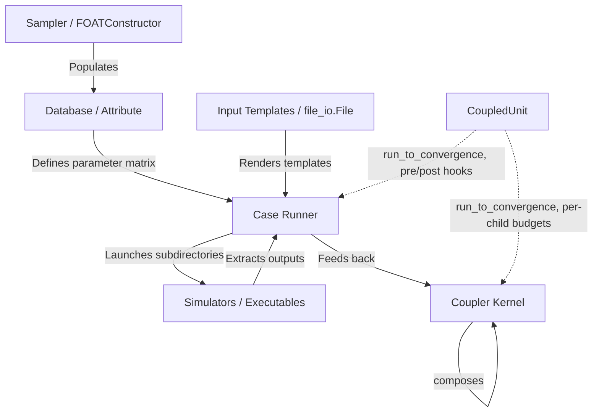

# Labeeb: Sensitivity & Uncertainty Analysis API

[](https://python.org)
[](LICENSE)

**Labeeb** is a professional, general-purpose Python API package developed at the **Jordan Research and Training Reactor (JRTR)**. It provides a clean, programmatic interface for conducting sensitivity analyses, uncertainty studies, and parameter sweeps on any simulation code (e.g. MCNP, RELAP5, or general numerical simulators) that relies on text files as input decks.

> 📖 **Comprehensive Guide**: See the complete [v1.6.0 User Manual & API Guide](docs/USER_MANUAL.md) for in-depth examples covering declarative harvesters, coupling stability controls, and non-blocking shared campaign memory.

> 🛠️ **Developer Guide**: See [docs/DEVELOPER_GUIDE.md](docs/DEVELOPER_GUIDE.md) for architecture/API contracts, extension points, lifecycle & events, persistence/failure semantics, test conventions, compatibility rules, and debugging recipes.

---

## 1. Package Architecture

Labeeb is designed for general-purpose model coupling and sensitivity studies. It combines parameter data tables, template search-and-replace linkage flags, and directory orchestrations into a cohesive run loop:



---

## 2. Installation

Install Labeeb locally in editable mode for development:

```bash
pip install -e .[dev]
```

---

## 3. API Usage Guide

### A. Database & Attributes (`labeeb.database`)
`Attribute` represents a sequence column, supporting element-wise math. `Database` operates like a lightweight DataFrame.

```python
from labeeb.database import Attribute, Database

# Create attributes
rho = Attribute(name="RHO", data=[18.5, 19.0, 19.5], unit="g/cm3")
wf = Attribute(name="WF", data=[0.01, 0.02, 0.03], unit="fraction")

# Attributes support element-wise math and comparisons
density_in_g = rho * 1000.0
is_high = rho > 19.0  # Returns Attribute list of booleans

# Orchestrate in a Database
db = Database(name="reactor_params")
db.add_attribute(rho, wf)

# Declarative Derived Attributes (e.g. power calculation, auto-dependency tracking)
db.add_derived_attribute("RHO_KG", "RHO * 1000.0", unit="kg/m3")
db.add_derived_attribute("SCALED_WF", lambda row: row["WF"] * 100.0, dependencies=["WF"], unit="%")

# Fetch rows
row_0 = db.get_row(0)  # {'RHO': 18.5, 'WF': 0.01, 'RHO_KG': 18500.0, 'SCALED_WF': 1.0}

# Import and Export tabular CSV/Excel data
db.export_to_file("data.csv")
db.import_from_file("data.csv", option="new")
```

### B. Sampler & Sweeps (`labeeb.sampler`)
Generate design matrices and parameters using grid sweeps or statistical distributions.

```python
from labeeb.sampler import FOATConstructor, DiscreteSampling

# 1. Grid Sweeper (Full Factorial Sweep)
constructor = FOATConstructor()
constructor.add_case({
    "RHO": [18.0, 19.0],
    "WF": [0.01, 0.02, 0.03]
})
grid = constructor.construct()
# Generates 6 combinations of (RHO, WF)

# 2. Discrete Probability Sampling
sampler = DiscreteSampling()
sampler.define_sample(
    values=["A", "B"], 
    probs=[0.85, 0.15]
)
fuel_types = sampler.get_random_sample(n=100)
stats = sampler.stat(m=1000)
```

### B1. Campaign Manifests (`labeeb.campaign`)
Validated JSON and YAML manifests capture a campaign's parameter space, input
templates, commands, seed, and execution settings. Provenance records stable
manifest/template hashes and executable discovery metadata.

```python
from labeeb.campaign import load_manifest

campaign = load_manifest("campaign.yml")
print(campaign.provenance()["manifest_sha256"])
```

For Python-authored case studies, use the `Campaign` API directly. It builds
the existing `Case` runner, executes each parameter row, and returns structured
results; SQLite state enables safe reruns without making the CLI part of the
case-study design.

```python
from labeeb import Campaign

campaign = Campaign.from_manifest("campaign.yml", state_path="state.sqlite")
results = campaign.run()
assert all(result.status == "SUCCESS" for result in results)
```

Campaign observability is opt-in: give the campaign an `EventPublisher` plus a
`live_plot` observer (instance or config mapping) to plot parameters/metrics
online, and/or an `output_catalog` path to persist one record per executed
attempt:

```python
from labeeb import Campaign, PlotObserver, JsonlEventPublisher

campaign = Campaign(
    load_manifest("campaign.yml"),          # or Campaign.from_manifest(...)
    publisher=JsonlEventPublisher("runs/events.jsonl"),
    live_plot=PlotObserver(metrics=["RHO"], output_path="runs/live.png"),
    output_catalog="catalog.sqlite",        # every attempt: status/metrics/stdout-stderr
)
campaign.run()
```

Failure/output behavior: a failing case is recorded (FAILED status, catalog row,
`case_failure` event) and never aborts the remaining rows; harvesters declared
with `optional=True` record `None` instead of failing when their file is absent;
observer attach/detach/close errors are logged and isolated — plotting can never
fail the campaign — and the observer is detached and closed even when `run()`
raises. Command and harvest failures are policy-driven:
`command_failure_policy="stop"|"continue"|"retry"` (default `stop`, the classic
fail-fast raise; `retry` reruns up to `max_attempts`) and
`harvest_failure_policy="stop"|"continue"` (default `stop`) — set per `Case`,
via `set_vars`, or through `execution.command_failure_policy` /
`harvest_failure_policy` / `max_attempts` in the manifest. Every failure is
recorded (history, FAILED results, catalog rows) regardless of policy.

Optimization: `Optimizer` proposes candidates inside declared bounds (grid or
seeded random), evaluates each through a simulation-backed objective, honors
constraints, records every candidate, and supports budget/stall/wall-time
termination, atomic JSON checkpoints and resume (see USER_MANUAL §14). Optional
`labeeb.ai` layers — imported lazily so the core stays lightweight — add a
scikit-learn `SurrogateModel` (with save/load persistence), scipy and Optuna
`optimize_*` adapters returning the same `OptimizeResult` shape, and optional
PyTorch/BoTorch NN surrogate backends.

Designs can also be generated inside the same Python file:

```python
from labeeb import halton_sample, latin_hypercube_sample

lhs = latin_hypercube_sample([(0.0, 1.0), (280.0, 340.0)], 100, seed=42)
low_discrepancy = halton_sample(100, dimensions=2)
```

### B2. Structured Results (`labeeb.results`)
`CaseResult` retains parameters, execution status, exit code, duration, artifacts,
metrics, and failure details for every case, including failed cases.

```python
from labeeb.results import CaseResult, export_case_results

results = [CaseResult(0, {"RHO": 19.0}, "SUCCESS", 0, 1.2, metrics={"keff": 1.0})]
export_case_results(results, "campaign_results.csv")   # .csv / .json / .parquet / .xlsx
```

Declared outputs are discovered in each case's run directory: `output_files`
CSV columns are required, while harvesters (`CsvHarvester`, `JsonHarvester`,
`RegexHarvester`, `ExcelHarvester`, `CallableHarvester`) are required by default
and optional with `optional=True` — an optional output that was not produced is
recorded as `None` instead of failing the case. Case input templates are copied
into `case_<id>` run directories and rendered there (flags, assignments,
`${expr}`), leaving the original template untouched.

`CampaignStateStore` persists attempts for resume/retry workflows and prevents
cache reuse when the input hash changes.

```python
from labeeb.results import CampaignStateStore

with CampaignStateStore("campaign_state.sqlite") as state:
    if state.should_reuse(case_id=0, input_hash=input_hash):
        print("reuse cached result")
```

`OutputCatalog` (`labeeb.outputs`) keeps an append-only, durable per-attempt
ledger alongside the state store: each (case, attempt) execution links harvested
metrics, artifact paths, stdout/stderr files, byte counts, redacted command, and
status — nothing is overwritten, so retries and failures stay queryable and
exportable to CSV/JSON/Parquet. `Campaign.run()` writes this ledger automatically
when configured — `Campaign(manifest, output_catalog="catalog.sqlite")` or
`execution.output_catalog` in the manifest — recording each executed attempt
(successes, failures, and retries) while staying fully disabled by default.

### Backup & Restore (`labeeb.backup`)
Back up campaign state and run artifacts as one validated, atomic snapshot:

```python
from labeeb import create_backup, validate_backup, restore_backup

backup_dir = create_backup(
    "backups/campaign_20260902",
    state_path="campaign_state.sqlite",     # sqlite-safe online backup snapshot
    artifacts=["runs/", "notes.txt"],       # copied byte-for-byte
)
manifest = validate_backup(backup_dir)      # version + every SHA-256 + PRAGMA quick_check
restore_backup(
    backup_dir,
    state_path="restored_state.sqlite",     # temp-file + atomic replace
    artifacts_root="restored_runs/",
)
```

SQLite state files are captured with the sqlite3 online-backup API from a
read-only connection — never by copying a live file — and every backup carries a
`manifest.json` (format/version/created_at + per-file SHA-256 checksums).
Backups are staged beside the destination and atomically renamed into place;
existing non-empty destinations are never overwritten. Restore validates the
whole backup first, then restores the database via a sibling temp file and
`os.replace`, and artifacts via atomic per-file replacement. Shared-memory
snapshots follow an explicit opt-in policy: memory is derived/volatile and is
exported only when you pass `memory_snapshot={...}` (e.g.
`campaign.memory.snapshot()`), producing `shared_memory.json`; otherwise the
manifest records that memory was deliberately excluded.

### B3. Execution Backends (`labeeb.execution`)
`Case` uses an injectable execution backend. The built-in local backend runs
shell commands with an explicit case directory, timeout, optional log file,
and normalized `ExecutionResult`. It logs command start, working directory,
completion/exit code, duration, timeout, and launch errors through the
`labeeb.execution` logger. Scheduler backends can implement the same interface.
Each run also exposes a typed `ExecutionEvent`; use
`export_execution_events()` to persist an auditable JSON event stream.
For long-running campaigns, configure `execution.events_file` in the manifest
to append each event incrementally as JSONL.
Campaign streams include start, cache-hit, retry, command, success/failure,
and completion events. Set `execution.capture_output` to retain per-case
`stdout.log` and `stderr.log` artifacts. Use `json_format=True` for structured
logs; common password, token, secret, and API-key values are redacted.

Each `ExecutionEvent` also carries failure/timeout context (`message`,
`timed_out`) plus command/cwd/timing/exit and stdout/stderr byte counts, and is
mirrored into `case.execution_history`. Structured JSON log records embed the
full event under a `payload` key with `case_id`/`unit`/`attempt` context.
Redaction covers key/value secrets (`password=...`, `api_key=...`) and CLI-flag
values (`--api-key sk-123`, `-password hunter2`) across log lines, JSON
payloads, events, and history. Without `configure_logging()`, execution logging
stays disabled and command behavior is unchanged.

```python
from labeeb.case import Case
from labeeb.execution import LocalExecutionBackend
from labeeb import configure_logging

configure_logging(level="INFO", log_file="campaign.log")
case = Case("local")
case.execution_backend = LocalExecutionBackend()
```

### B4. Configuration-First CLI
The installed `labeeb` command supports manifest validation and local runs:

```bash
labeeb validate campaign.yml
labeeb run campaign.yml --state campaign_state.sqlite
labeeb status campaign_state.sqlite
labeeb resume campaign_state.sqlite
```

### B5. Sensitivity and Reports (`labeeb.analysis`, `labeeb.report`)
The analysis APIs operate directly on arrays, mappings, or pandas tables and do
not require SciPy. They cover rank/linear correlation, Morris screening,
Saltelli-style Sobol estimates, and Wilks sample-size planning.

```python
from labeeb import correlation_analysis, wilks_sample_size, write_html_report

correlations = correlation_analysis({"rho": [1, 2, 3]}, [2, 5, 7])
required_cases = wilks_sample_size(coverage=0.95, confidence=0.95, sides=1)
write_html_report(results, "campaign_report.html")
```

### B6. v1.0 API stability
The supported public surface is the names exported by `labeeb.__all__`. The 1.x
series preserves those names and documented signatures; incompatible changes
require a future major version.

Imports are silent by default. To display the identification banner, set
`LABEEB_SHOW_BANNER=1` before importing, or call `labeeb.print_banner()`.

### C. Case Launcher & Templates (`labeeb.case` & `labeeb.utils.file_io`)
Define templates, render inputs, execute runs, and parse output tables. Labeeb supports two template rendering options:

#### Option 1: Sequential Placeholder Replacement (`File.replace()`)
For standard template files with unique delimiter-wrapped flags (e.g. `#RHO#`, `#WF#`):

```python
from labeeb.case import Case, Flag, FlagsMap
from labeeb.database import Database
from labeeb.utils.file_io import File

template_file = File(file_path="template.txt")
flags = FlagsMap().add_flag(
    Flag("#RHO#", "RHO", "%5.2f"),
    Flag("#WF#", "WF", "%6.4f")
)

runner = Case(name="simulation_run")
runner.database = Database(data={"RHO": [18.5, 19.0], "WF": [0.01, 0.02]})
runner.FlagsMap = flags
runner.add_file(template_file)
runner.exe_cmd = ["simulator_exec inp=template.txt > log"]
runner.run_case_main_dir = "simulations"

runner.launch()
```

#### Option 2: Jinja2 Template Rendering (`File.render_jinja()`)
For general-purpose dynamic text files utilizing control flows, conditional blocks, or format filters:

```python
from labeeb.utils.file_io import File

# template.txt contains: "VALUE = {{ my_param }}"
template_file = File(file_path="template.txt").read()

# Render template with context
template_file.render_jinja({"my_param": 42.0})
template_file.write("rendered_input.txt")
```

#### Option 3: Assignment-Style Replacement (`File.replace_assignments()`)
For decks configured with assignment records like `x=1` or `flux = 1.23e-04`:

```python
from labeeb.utils.file_io import File

template = File("deck.inp").read()
# Replaces values while preserving syntax, separators, whitespace, and comments
template.replace_assignments(
    {"flux": 2.50e-04, "temp": 300.0},
    fmt={"flux": "{:.2e}", "temp": "%.1f"},
    strict=True,
)
```

#### Option 4: Inline Expression Evaluation (`File.replace_expressions()`)
For parameterized physics decks with embedded mathematical expressions `${expr : fmt}`:

```python
from labeeb.utils.file_io import File

template = File("core.inp").read()
# Replaces ${radius * 2.0 : %6.2f} and ${power_mw * 1e6 : {:.2e}} safely
template.replace_expressions({
    "radius": 5.0,
    "power_mw": 10.0,
})
```


### D. Coupling Kernel (`labeeb.coupler`)
Orchestrate coupled iterations between multiple simulation cases (e.g. thermal-hydraulics and neutronics).

```python
from labeeb.case import Case
from labeeb.coupler import Coupler
from labeeb.database import Database

mcnp_case = Case("mcnp")
relap_case = Case("relap")

# Define coupled sequences
coupler = Coupler(name="coupled_neutronics_th")
coupler.add_cases({
    mcnp_case: ["RHO"],  # Only map RHO to mcnp
    relap_case: ["WF"]   # Only map WF to relap
})

coupler.database = Database(data={
    "RHO": [19.0, 19.2],
    "WF": [0.01, 0.02]
})

# Define iteration callbacks
def callback(self, **kwargs):
    print(f"Iter step {self.c_step}: case {self.case_name} run complete.")

coupler.add_coupling_functions(callback)

# Launch coupled iterations
coupler.launch()
```

### E. Convergence-Driven Execution (`labeeb.coupled_unit`)
`Case` and `Coupler` both inherit `CoupledUnit`, which adds a convergence
loop on top of a single execution pass: `run_to_convergence()` repeats
`launch_case()` (for a `Case`) or a full coupling step (for a `Coupler`)
until a `check_fn` you supply returns `True`, or `max_exec` attempts are
used. Each unit also carries ordered `pre_functions`/`post_functions`
lists, run around every pass -- useful for pulling in the latest state
before a run, or parsing/validating results right after one.

```python
from labeeb.case import Case
from labeeb.database import Database

case = Case(name="mcnp")
case.database = Database(data={"RHO": [19.0]})
# ... FlagsMap / input files / exe_cmd as above ...

def refresh_flags(unit, **kwargs):
    print(f"Starting attempt for {unit.name}")

def check_keff_converged(unit, **kwargs):
    keff = unit.outputs["keff"][-1][-1]
    return abs(keff - 1.0) < 1e-4

case.add_pre_functions(refresh_flags)

result = case.run_to_convergence(max_exec=10, check_fn=check_keff_converged)
print(result.converged, result.executions)  # ConvergenceResult
```

A `Coupler` composes over both `Case` and `Coupler` children uniformly --
a `Coupler` can itself be a child of another `Coupler` for sub-coupling.
Each child's own convergence budget (`max_exec`/`check_fn`) is set at
`add_case()` time and can be changed between coupling steps:

```python
coupler.add_case(mcnp_case, attributes=["RHO"], max_exec=5, check_fn=check_keff_converged)
coupler.set_unit_convergence("mcnp", max_exec=8)  # retune mid-run

# One coupling step: every child runs to ITS OWN convergence (in order),
# then coupling functions fire exactly once -- after all children have
# resolved, not per-child -- so feedback sees every unit's final state.
coupler.launch_case(c_step=0)

# Or drive the whole coupled system to convergence:
result = coupler.run_to_convergence(max_exec=20, check_fn=overall_check_fn)
```

### F. Exception Handling (`labeeb.exceptions`)
Labeeb raises clean, module-specific exceptions to help you identify failures programmatically:
*   `LabeebError`: Base exception class.
*   `DatabaseError`: Issues with Attribute dimensions, operations, or imports.
*   `SamplingError`: Mismatches in sampler sizing or uninitialized CDFs.
*   `CaseExecutionError`: Command-line command errors, missing template decks, or unreadable outputs.
*   `CouplingError`: Missing databases or configurations inside the coupler.

---

## 4. Running Tests

Run the unit test suite to verify code compliance and safety:

```bash
pytest tests/
```
